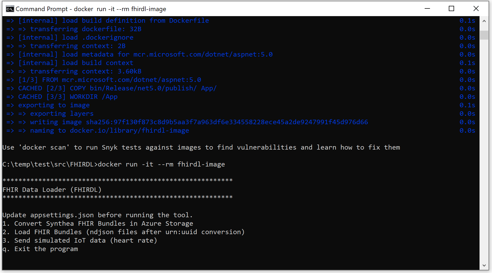
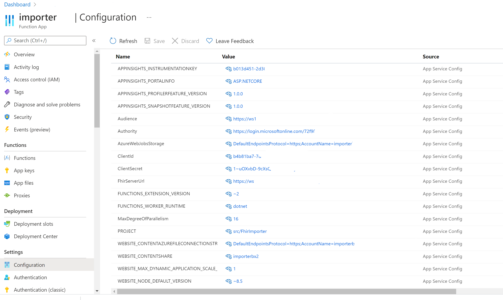

# Load Data to the Healthcare APIs

While you can load some data using tools such as Postman and the Rest Client extension in Visual Studio, you can use the tools below to load FHIR bundles and ingest simulated device data.

## Load data to the FHIR service using the standalone tool

The FHIRDL tool is a standalone app, written in C#, that you can deploy and run locally using Docker Container. See more info on [Containerize a .net app](https://docs.microsoft.com/en-us/dotnet/core/docker/build-container?tabs=windows).

>[!Note]
>Make sure you have generated Synthea data and loaded it to an Azure storage account. You can also download data from sources such as [this one](https://synthea.mitre.org/downloads).

For example, use the command below to generate 100 patients in the State of Washington with a seed number 12345. The seed number ensures the consistency of the Synthea data. See [How to generate Synthea data](https://github.com/synthetichealth/synthea/wiki/Basic-Setup-and-Running)

`
java -jar synthea-with-dependencies.jar Washington -p 100 -s 12345
`

- Download the app
`
  git clone https://github.com/microsoft/healthcare-apis-samples.git
`

- Navigate to the folder where the docker file is located, e.g. "C:\myfolder\src\FHIRDL" on Windows 10, or equivalent folder on Linux.
- Modify the aspsettings.json file, and replace values in it.
  - change the connection string to your storage account
  - change the client app credentials
  - change the event hub connection string (only if the IoT Connector is used)
- Run the commands. Compile the code, build a docker image, and run it.
  
```
    dotnet publish -c Release

    docker build -t fhirdl-image -f Dockerfile .

    docker run -it --rm fhirdl-image
```

- Optionally, delete the docker image
`
docker rmi fhirdl-image
`


## Load data to the FHIR service using the importer

The Importer is a Azure Blob Trigger (Azure Function in C#) available at <a href="https://github.com/microsoft/fhir-server-samples/tree/master/src/FhirImporter" target="_blank">FHIR Server Samples</a>

You can deply the Azure Function manually, or using PowerShell or CLI scripts.

Replace the values before running the script.

```
$resourcegroupname="xxx"
$fhirserviceurl="xxx"
$importername ="xxx"
$location="xxx"
$tenantid="xxx"
$subscriptionid="xxx"
$tenantid="xxx"
$fhirclientid="xxx"
$fhirclientsecret="xxx"
$importertemplate="src/templates/importer.json"
```

- [Deploy Importer with PowerShell](/src/scripts/importer.ps1)
- [Deploy Import with CLI](/src/scripts/importer.bash)

After deployment, verify that the importer Azure Function settings are correct and make changes if necessary.

