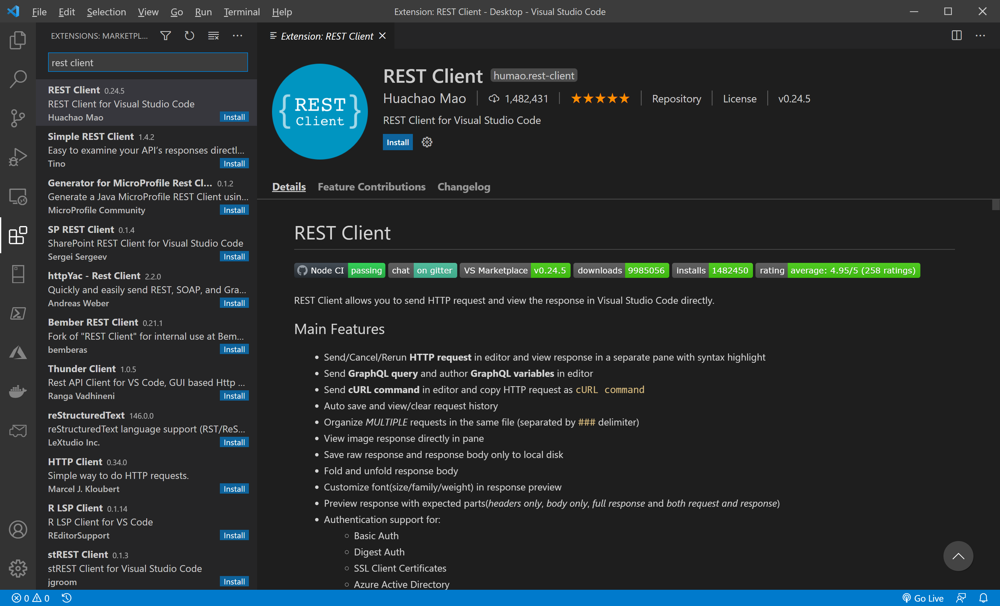

# Accessing the Healthcare APIs using the Rest Client Extension in Visual Studio Code

You can use the [Rest Client](https://marketplace.visualstudio.com/items?itemName=humao.rest-client) extension in Visual Studio Code to interact with the Healthcare APIs. Alternatively, you can access the Healthcare APIs with tools like Postman and your applications.

**Install Rest Client**

You can install the extension in Visual Studio Code easily. Select the Extensions icon on the left side and search "Rest Client". Click the Rest Client entry from the search results and press the Install button.



After installing the Rest Client extension, you are ready to make restful API calls. You can find more details on how to use the tool in the [installation file](https://marketplace.visualstudio.com/items?itemName=humao.rest-client).

**Create an ".http" File and Define Variables**

Create a new file in Visual Studio Code. Enter a Get request command line in the file, and save it as "test.http". The file suffix ".http" automatically activates the Rest Client environment. Click on "Send Request" which is supplied by the tool to get the metadata. 


**Get Client Application Values**

Before making restful API calls to the FHIR server (other than getting the metadata), you must complete the following prerequisite.

>[!Important] 
  Complete [application registration](https://docs.microsoft.com/en-us/azure/healthcare-apis/fhir/fhir-app-registration). Make a note of the Azure tenant id, client id, client secret and the service url.

While you can use values such as the client id directly in the restful API calls, it is a good practice that you define a few variables for these values and use the variables instead.

Copy and paste the code to the file. The line with "###" is a comment.

```
### REST Client
@fhirurl =https://xxx.azurehealthcareapis.com
@clientid =xxx....
@clientsecret =xxx....
@tenantid =xxx....
```

**Get AAD Access Token**

Copy and past your application registration values to the file. You can now get an access token issued by Azure Active Directory for the Healthcare APIs. 

>[!Note] 
>The grant_type of client_credentials is used to obtain an access token.

```
### Get access token 
# @name getAADToken 
POST https://login.microsoftonline.com/{{tenantid}}/oauth2/token
Content-Type: application/x-www-form-urlencoded

grant_type=client_credentials
&resource={{fhirurl}}
&client_id={{clientid}}
&client_secret={{clientsecret}}

### Extract access token from getAADToken request
@token = {{getAADToken.response.body.access_token}}

```

Click on "Send Request". You will see an http response that contains the access token if successful. 

The line starting with "#" contains a variable that captures the http response containing the access token. The variable, @token, is used to store the access token. 


**Get FHIR Data**

You can now get a list of patients or a specific patient with the Get request. The line with "Authorization" is the header info for the Get request. You can also send Put or Post requests to create/update FHIR resources.

```
### Get Patient 
#Get {{fhirurl}}/Patient
Get {{fhirurl}}/Patient/<patientid>
Authorization: Bearer {{token}}
```


**Run PowerShell or CLI**

You can run PowerShell or CLI scripts within Visual Studio Code. Press "CTRL" and the "~/`" key and select PowerShell or Bash. You can find more details on [Integrated Terminal](https://code.visualstudio.com/docs/editor/integrated-terminal).

PowerShell in Visual Studio Code


CLI in Visual Studio Code


**Troubleshooting**

If you are unable to get metadata, which does not require access token based on the HL7 specification, check that the FHIR server is running.

If you are unable to get an access token, make sure that the client application is registered properly and you are using the correct values.

If you are unable to get data from the FHIR server, make sure that the client application (or the service principal) has been granted access permissions such as "FHIR Data Contributor" to the FHIR server.
